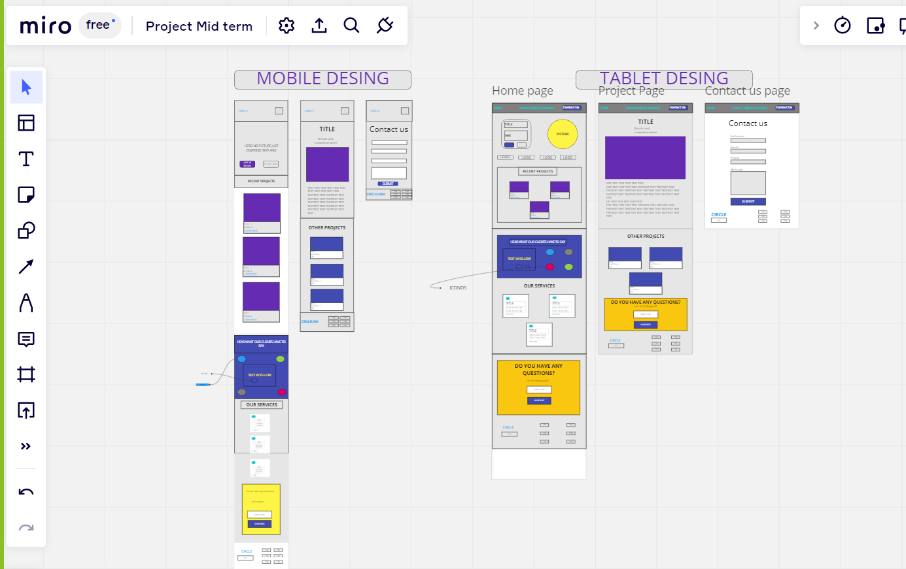

# Welcome to Circle!

## Project Description
This is a website for "Circle" a company that desings and develops websites and apps.
It is composed of three pages:

 - Home Page: With different sections, where you get to know about what the company does, see their recent projects, know some of their clients and their review on Circle, what services they provide and a section to get in touch with them.
 - Project Page: Here you get to see the projects in more detail. You can click on the one you would like to see. Also, you have a section to ask them questions.
 - Contact Page: Here you can find a form to send a message to Circle and let them know about any doubts that you have.

 ## WIREFRAMES:

## About the website

 1. **Design:**
 The design was provided to me by my client, they provided the Desktop version and I implemented it for different sizes of screen:
 -Mobile: screens up to 421px.
 -Tablet: screens up to 1250px.
 -Desktop: form 1250px on.
 
 2. **Navigate between pages:**
 From every page you can get to any other page you want, you just have to use the navbar on top or the different links you would find in the page.
 
 3. **Details about Home Page**
 You will find there a section with the most recent 3 projects that circle has done, if you click on them, you will navigate to the Project Page!
 
 4. **Details about the Project Page**
 By default you will see displayed the project "Simplify", but you can click on any other project of the section "Other projects" and you will see it as a main project with all its details.
 
 5. **Details about the Contact Page**
 It has a form to get in contact with Circle, and you must fill all its fields to get in touch with them! Otherwise it will show an error. 
 Also, it has an *alert* that will stop you to identify your self as *Ironhack*.
 
 ## Technologies used:
For this project I have used **Vanilla Javascript** in order to get all the funcionalities.
For the layout I used **HTML** and **CSS**, and the responsive design it´s been implemented using mediaqueries, and following a mobile first approach.

# Link to website
[Visit Circle](https://circle-blanca.netlify.app/html/home.html)

## Future work
Implementing more functionalities to the website like receiving something when the user sends a form.

## Resources
I used a design provided in Figma by my teachers and the usual sources to get information like stackoverflow, the Ironhack website and internet videos.